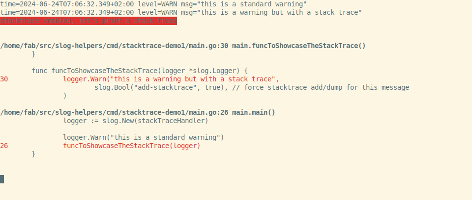
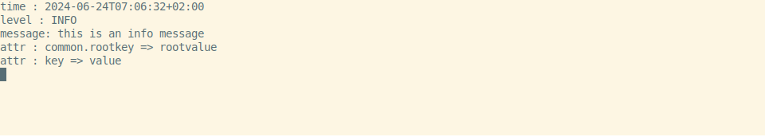

# slog-helpers

[Golang slog](https://pkg.go.dev/log/slog) structured logging library added in Go 1.21 is a great library. However, it lacks some helpers that are useful in practice. This library provides some of those helpers.

## Principles

- we want to stick as closely as possible to slog standards and objects without creating new concepts, types or interfaces
- we want to provide a kind of duality:
    - some generic and configurable handlers you can use in plenty of contexts
    - an opinionated [twelve-factor app inspired](https://12factor.net/) "setup helper" that will make a full-featured [slog.Logger](https://pkg.go.dev/log/slog#Logger) with a minimal amount of boilerplate code (by using environment variables and opinionated choices).

## Features

- 1️⃣ a ready-to-use [slog.Handler](https://pkg.go.dev/log/slog#Handler) that prints (or embeds in a [slog.Attr](https://pkg.go.dev/log/slog#Attr) for JSON output for example) a stacktrace when an error is logged with `ERROR` level or with a `stacktrace=true` attribute
- 2️⃣ a ready-to-use [slog.Handler](https://pkg.go.dev/log/slog#Handler) that prints logs in console for humans (with a readable format and colors)
- 3️⃣ a utility [slog.Handler](https://pkg.go.dev/log/slog#Handler) that doesn't print or write something by itself but calls external function callbacks with 3 different types of API:
    - a full-featured one with all the richness (but also complexity) of [slog.Attr](https://pkg.go.dev/log/slog#Attr) (different kinds of values, recursive groups...)
    - a simplified one (with stringified and flattened [slog.Attr](https://pkg.go.dev/log/slog#Attr))
    - and a compromise between the two
- 4️⃣ an opinionated [twelve-factor app inspired](https://12factor.net/) "setup helper" that will make a full-featured [slog.Logger](https://pkg.go.dev/log/slog#Logger) with a minimal amount of boilerplate code (by using environment variables and opinionated choices)

## Quickstart

### Installation

`go get github.com/fabien-marty/slog-helpers`   

### Usage (1️⃣ StackTracer handler)

#### Source

```go
package main

import (
	"log/slog"
	"os"

	"github.com/fabien-marty/slog-helpers/pkg/stacktrace"
)

func main() {
	// Create a first handler
	textHandler := slog.NewTextHandler(os.Stderr, &slog.HandlerOptions{})

	// Create a new StackTrace handler by decorating the first one
	stackTraceHandler := stacktrace.New(textHandler, &stacktrace.Options{
		HandlerOptions: slog.HandlerOptions{
			AddSource: true,
		},
		Mode: stacktrace.ModePrintWithColors,
	})

	// Create a logger with the StackTrace handler
	logger := slog.New(stackTraceHandler)

	logger.Warn("this is a standard warning")
	funcToShowcaseTheStackTrace(logger)
}

func funcToShowcaseTheStackTrace(logger *slog.Logger) {
	logger.Warn("this is a warning but with a stack trace", slog.Bool("add-stacktrace", true))
}

```

#### Output



### Usage (2️⃣ Console handler)

#### Source

```go
package main

import (
	"log/slog"
	"os"

	"github.com/fabien-marty/slog-helpers/pkg/human"
)

func main() {
	// Create a new human handler
	humanHandler := human.New(os.Stderr, &human.Options{
		HandlerOptions: slog.HandlerOptions{
			AddSource: true,
			Level:     slog.LevelDebug,
		},
		UseColors: true, // force the usage of colors (the default behavior is to detect if the output is a terminal)
	})

	// Create a logger with this handler
	logger := slog.New(humanHandler)

	// Create a sub-logger with some default group/key
	logger = logger.With(slog.Group("common", slog.String("rootkey", "rootvalue")))

	// Log some messages
	logger.Debug("this is a debug message", slog.String("key", "value"))
	logger.Info("this is an info message")
	logger.Warn("this is a warning message", slog.Int("intkey", 123))
	logger.Error("this is an error message")
}

```

#### Output


### Usage (3️⃣ External handler)

#### Source

```go
package main

import (
	"fmt"
	"log/slog"
	"time"

	"github.com/fabien-marty/slog-helpers/pkg/external"
)

// callback is called for each message logged
//
// attrs is a list of key/value pairs (as flattened strings)
func callback(t time.Time, level slog.Level, message string, attrs []external.StringifiedAttr) error {
	fmt.Println("time   :", t.Format(time.RFC3339))
	fmt.Println("level  :", level)
	fmt.Println("message:", message)
	for _, attr := range attrs {
		fmt.Printf("attr   : %s => %s\n", attr.Key, attr.Value)
	}
	return nil
}

func main() {
	// Create a new external handler
	handler := external.New(&external.Options{
		StringifiedCallback: callback, // use the simplified callback form (2 other forms are available)
	})

	// Create a logger with this handler
	logger := slog.New(handler)

	// Create a sub-logger with some default group/key
	logger = logger.With(slog.Group("common", slog.String("rootkey", "rootvalue")))

	// Log a message
	logger.Info("this is an info message", slog.String("key", "value"))
}

```

#### Output



### Usage (4️⃣ All in one with the setup helper) 

#### Source

```go
package main

import (
	"log/slog"

	"github.com/fabien-marty/slog-helpers/pkg/slogc"
)

func main() {

	// Create a new slog.Logger automatically configured from environment variables and given options
	logger := slogc.GetLogger(
		slogc.WithLevel(slog.LevelDebug),
		slogc.WithStackTrace(true),
		slogc.WithColors(true),
	)

	// Create a sub-logger with some default group/key
	logger = logger.With(slog.Group("common", slog.String("rootkey", "rootvalue")))

	// Log some messages
	logger.Debug("this is a debug message", slog.String("key", "value"))
	logger.Info("this is an info message")
	logger.Warn("this is a warning message", slog.Int("intkey", 123))
	funcToShowcaseTheStackTrace(logger)

}

func funcToShowcaseTheStackTrace(lgr *slog.Logger) {
	lgr.Warn("this is a warning but with a stack trace", slog.Bool("add-stacktrace", true))
}

```

#### Output (without particular env (default) or with env var `LOG_FORMAT=text-human`)


#### Output (with env var `LOG_FORMAT=json`)

```json
{"time":"2024-05-25T13:53:26.98306+02:00","level":"DEBUG","source":{"function":"main.main","file":"/Users/fab/src/slog-helpers/cmd/slogc-demo1/main.go","line":22},"msg":"this is a debug message","common":{"rootkey":"rootvalue"},"key":"value"}
{"time":"2024-05-25T13:53:26.983165+02:00","level":"INFO","source":{"function":"main.main","file":"/Users/fab/src/slog-helpers/cmd/slogc-demo1/main.go","line":23},"msg":"this is an info message","common":{"rootkey":"rootvalue"}}
{"time":"2024-05-25T13:53:26.983168+02:00","level":"WARN","source":{"function":"main.main","file":"/Users/fab/src/slog-helpers/cmd/slogc-demo1/main.go","line":24},"msg":"this is a warning message","common":{"rootkey":"rootvalue"},"intkey":123}
{"time":"2024-05-25T13:53:26.983171+02:00","level":"WARN","source":{"function":"main.funcToShowcaseTheStackTrace","file":"/Users/fab/src/slog-helpers/cmd/slogc-demo1/main.go","line":30},"msg":"this is a warning but with a stack trace","common":{"rootkey":"rootvalue"},"stacktrace":"stack trace\n/Users/fab/src/slog-helpers/cmd/slogc-demo1/main.go:30 main.funcToShowcaseTheStackTrace()\n/Users/fab/src/slog-helpers/cmd/slogc-demo1/main.go:25 main.main()"}

```